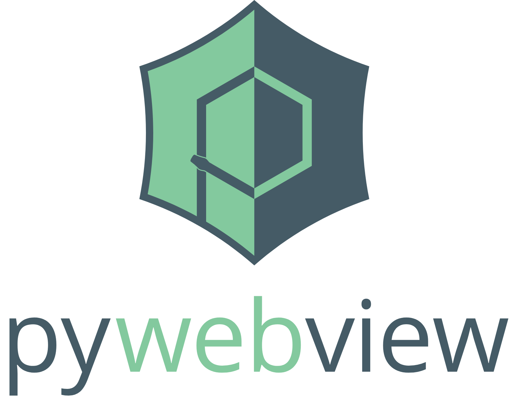

<p align='center'></p>

<p align='center'><a href="https://opencollective.com/pywebview" alt="Financial Contributors on Open Collective"></a>   <a href="https://github.com/imattau/pywebview2"></a>

https://github.com/imattau/pywebview2
</p>

_pywebview2_ is a lightweight native webview wrapper that allows to display HTML content in its own native GUI window. It gives you power of web technologies in your desktop application, hiding the fact that GUI is browser based. _pywebview2_ ships with a built-in HTTP server, DOM support in Python and window management functionality.

_pywebview2_ is available for Windows, macOS, Linux (GTK or QT) and Android. It uses native GUI for creating a web component window: WinForms on Windows, Cocoa on macOS and QT or GTK on Linux. If you choose to freeze your application, _pywebview2_ does not bundle a heavy GUI toolkit or web renderer with it keeping the executable size small.

_pywebview2_ provides advanced features like window manipulation functionality, event system, built-in HTTP server, native GUI elements like application menu and various dialogs, two way communication between Javascript ↔ Python and DOM support.

_pywebview2_ is developed on top of the original pywebview created by [Roman Sirokov](https://github.com/r0x0r/).


## Install

``` bash
pip install pywebview2
```

_You might need additional libraries. Refer to the documentation page for details._

## Hello world

``` python
import webview
webview.create_window('Hello world', 'https://pywebview.flowrl.com/hello')
webview.start()
```

Explore _pywebview2_ further by reading documentation, exploring [examples](https://github.com/imattau/pywebview2/tree/master/examples) or contributing.


## Sponsors

[](https://www.testmuai.com/?utm_medium=sponsor&utm_source=pywebview)


## Code Contributors

This project thrives thanks to the contributions of our community. [[Learn how to contribute](docs/contributing/README.md)].

<a href="https://github.com/imattau/pywebview2/graphs/contributors"></a>

## Consulting services

If your company is looking for support with _pywebview2_ or needs a hand with full-stack development, the author of _pywebview_ is available for hire. As a VAT-registered EU based professional, I specialize in a wide range of technologies, including JavaScript/TypeScript, React/Vue, Python, GIS, SQL databases, API integration, CI/CD pipelines and cloud solutions. For inquiries about availability and pricing details, reach out to roman@maumau.fi.

## Donate

Become a financial contributor and help us sustain our community. More donation options are outlined on the [Donating](https://pywebview.flowrl.com/contributing/donating.html) page.

[](https://github.com/sponsors/r0x0r)

[](https://www.patreon.com/bePatron?u=13226105)

[](https://opencollective.com/pywebview/donate)
